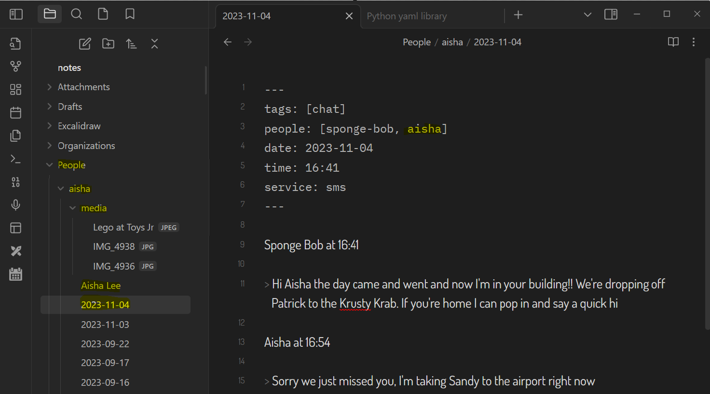
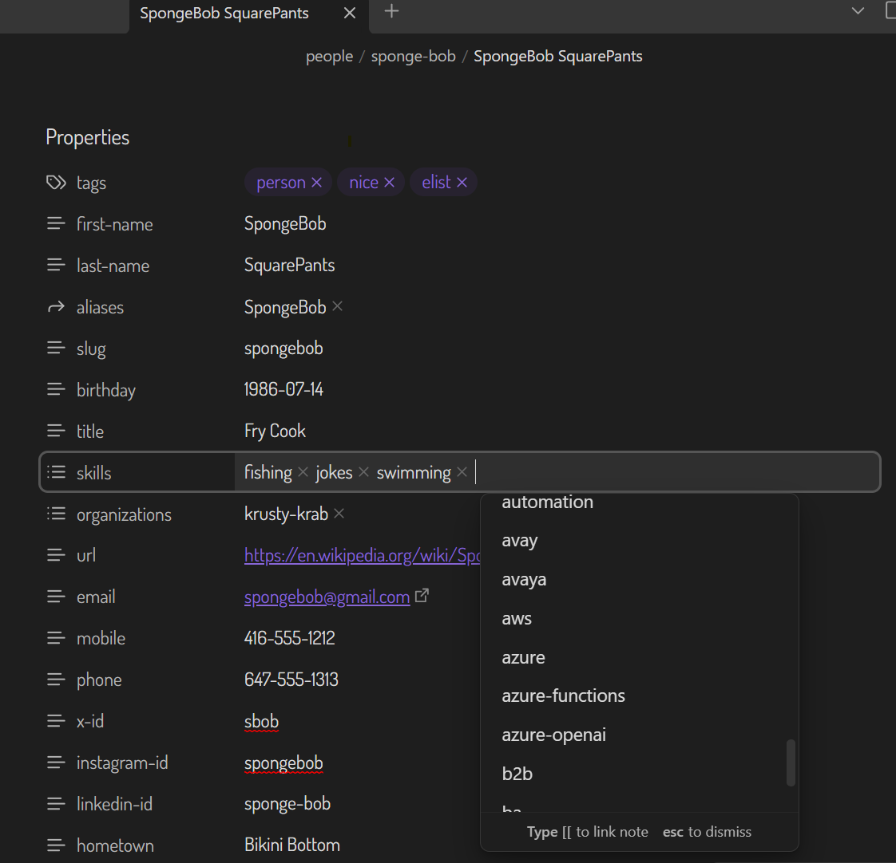

# hal_md

Personal relationship management of your ego social network using plain-text Markdown files. Think of it like a Personal CRM on steroids. You'll need steroids and patience to create the Markdown files but they'll be yours forever.

This is a collection of templates with instructions and over time it will evolve. The approach relies heavily on a Personal Knowledge Management (PKM) tool like [Obsidian](https://obsidian.md/) but could work with any text editor.

## Context

Getting here has been a decades-long journey which you can read about in [The Long and Winding Road](docs/journey.md).

## Start with the end in mind

This will take a long time to build out and require some attention to detail. 

Here's the visualization of my social network in Obsidian. This is using a filter of the Markdown files that have `tags: [person]` in their frontmatter – the meta-data at the top of my note files. The colors represent which category I have the person in such as the bright green for my "A-listers" where I have the tags `person` and `alist`. Red is for `flist`, i.e., the people that I don't want to keep in touch with for various reasons.

## Navigating your social network

You can use any text editor but preferably one that supports wikilinks, YAML frontmatter, and queries. 

1. [Obsidian](https://obsidian.md/) by fellow Canadians [Erica Xu](https://github.com/ericaxu) and [Shida Li](https://github.com/lishid)
2. [Silver Bullet](https://github.com/silverbulletmd) which is Open-Source by Polish [Zef Hemel](https://github.com/zefhemel)

I haven't checked if [GitJournal](https://github.com/GitJournal/GitJournal) by [Vishesh Handa](https://www.linkedin.com/in/visheshhanda/) supports YAML frontmatter but it does support wikilinks so you'll still be able to navigate your notes.

As shown in the above image, Obsidian has a graph view (aka Map of Content aka MoC) which is a really fun way to visualize and navigate your social network. The local graph view is much more useful at an individual person level. 

[Visual Studio](https://visualstudio.microsoft.com/) is also handy for bulk changes.

## How it works

Simply use Obsidian and start creating files for each `Person` and optionally `Organization` and `Place` using the [Templates](#templates)  provided. Include wikilinks in the body of the file in the form of `[[name]]` to "connect" the people, places, and organizations together as you go. 

1. Create a file for a person in your network
2. Use the [Person.md](templates/Person.md) template
3. Name the file `FirstName Lastname.md`
4. Fill in as little or as much of the metadata on the person
5. List the people they're connected to under `## People` using `[[FirstName LastName]]` 
6. List their positions under `## Positions` using `Title, [[Organization Name]]` 
7. Click on each person under `## People`
8. Have a sip of your favorite drink
9. Go to Step 2

### Bonus points

For each Organization under `## Organization` fill in as little or as much information on the organization.

For each person under `## People` add [tags](docs/tags.md) like `#friend` or `#strong` to track the strength of the ties between them.

## Folders, or no Folders, it's up to you

Organize your notes as you wish. I like to have folders.

- `Attachments` - for any files, images, photos
- `Organizations` - put all the company profiles in here
- `People` - put all the people in here. Subfolder with their `slug` and then dated files for each interaction
- `Personal` - my personal notes
- `Templates` - the files from [Templates](#templates) 

For most people, I create a folder for them and a sub-folder `media` for a photo of them and any images or files we shared with each other. 

My [Helper Tools](#helper-tools) put images and files I've shared into those `media` subfolders. For people that I haven't communicated with, I stuff those in `People\others` 

## Templates

These are a set of templates to track your social network. Each contain a set of metadata at the top of the files also known as YAML frontmatter. If you're not technical, don't worry as Obsidian makes it easy to edit that information.

File | For what | Notes
---|---|---
[Call.md](templates/Call.md) | A phone call | Do people still make these?
[Chat.md](templates/Chat.md) | Instant messaging chat | e.g. LinkedIn, Signal, SMS
[Organization.md](templates/Organization.md) | Schools and companies | Where a `Person` studie, volunteers, or works
[Person.md](templates/Person.md) | A person | The actual person!
[Place.md](templates/Place.md) | A physical place | Places people including you have been (e.g vacations, recommendations)
[Post.md](templates/Post.md) | Social media or blog post  | Material post by a `Person` 
[Product.md](templates/Product.md)| Product | A product worked on by a `Person` and/or `Organization`
[Video.md](templates/Video.md) |  Videos | e.g. YouTube video by `People`

## Frontmatter matters

A big part of this working well will be maintaining the frontmatter, you can sip things in over time like a new skill for a person or a new interest. You don't have to do it all at once. Just start.

In this example, you can see if you click in the skills field, Obsidian shows a list of skills other people have which makes it easy to be consistent across all people with that skill.

## What's a slug?

Each key template has a `slug` field which is a one-word or hyphenated word that uniquely identifies the Person, Place, Organization from others. It needs to be unique within each of the categories.

For example, [Organization.md](templates/Organization.md) has `people: []` in the frontmatter which could contain a comma separated list of Person slugs from individual [Person.md](templates/Person.md) files.

The [Chat.md](templates/Chat.md) template also has a `people` field to list the people that were part of the conversation. 

The [Place.md](templates/Place.md) template has a `people` field which you could use to list people that recommended the place. You won't need to put people that live or work there in this field since that information is already in their [Person.md](templates/Person.md) template.

## The Person

This is the most important template of the collectoin and there are two pages describing the file:

- [The Person's head](docs/person_frontmatter.md) describes each of the fields in the [Person.md](templates/Person.md) template.

- [The Person's body](docs/person_body.md) describes the sections of the body of the [Person.md](templates/Person.md) template.

## List of birthdays and anniversaries

With standard Obsidian (no additional plugins), create a file for each month of the year and include embedded queries to show the birthdays and anniveraries that month. The sample query files are [here](queries) and here's what they look like:

Which results in this (a bit ugly as you see the regex):

## Helper tools

I've written some Python tools to convert the exports from various messaging apps to Markdown. 

So far, I've created:

- [linkedin_md](https://github.com/thephm/linkedin_md) for Linkedin chats
- [signal_md](https://github.com/thephm/signal_md) for Signal messages
- [sms_backup_md](https://github.com/thephm/sms_backup_md) for SMS messages

Why? So I can get **my** conversations with people in **my** network into **my** own files that **I** can control and use directly with **my** social network data. Each of those tools rely on [message_md](https://github.com/thephm/message_md).
